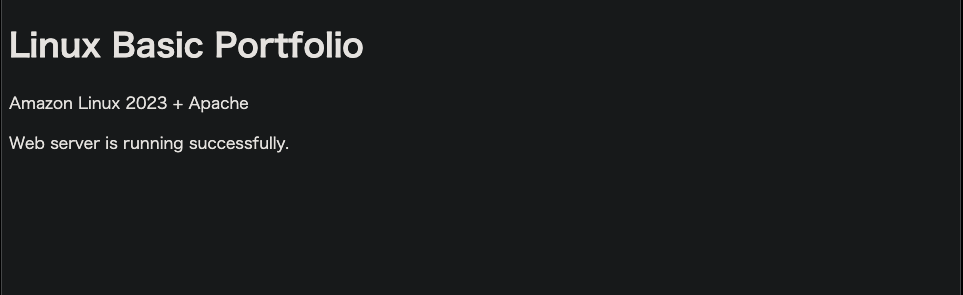

# Linux Basic Portfolio

Amazon Linux 2023上にApache Webサーバーを構築し、
Linuxの基本運用・監視・障害対応を実践したポートフォリオです。

**技術:** AWS EC2 / Amazon Linux 2023 / Apache / Bash / systemd / cron / SSH

## 構成

```text
Mac
├─ SSH（22番ポート）
└─ HTTP（80番ポート）
    ↓
AWS EC2（Amazon Linux 2023）
├─ Apache Webサーバー
│  └─ index.html を公開
├─ systemd
│  └─ Apacheの起動・停止・自動起動
├─ Bash
│  └─ server-health-check.sh
├─ cron
│  └─ ヘルスチェックを定期実行
└─ ログ確認
   ├─ access_log
   └─ journalctl

```

## 実施内容

- MacからEC2へSSH接続
- ユーザー・グループ・パーミッション管理
- Apache Webサーバーの構築・自動起動設定
- `ps`・`ss`・`curl` によるプロセス・ポート・HTTP確認
- `access_log`・`journalctl` によるログ調査
- Bashによるサーバーヘルスチェック作成
- cronによる定期実行

## 運用・障害対応

- cron実行時に発生した `ss: command not found` を調査し、絶対パス指定で解決
- Apache停止によるWeb障害を再現
- `systemctl` → `ps` → `ss` → `journalctl` の順に切り分け
- 復旧後に80番ポートのLISTEN、HTTP 200、Webページ表示を確認

## 成果物

- [`server-health-check.sh`](scripts/server-health-check.sh) - サーバー状態確認
- [`crontab.txt`](config/crontab.txt) - 定期実行設定
- [`index.html`](web/index.html) - Apache公開ページ
- [`troubleshooting.md`](docs/troubleshooting.md) - 障害対応の詳細

## 動作確認

### Webページ公開



障害対応の詳細は [`troubleshooting.md`](docs/troubleshooting.md) を参照。
