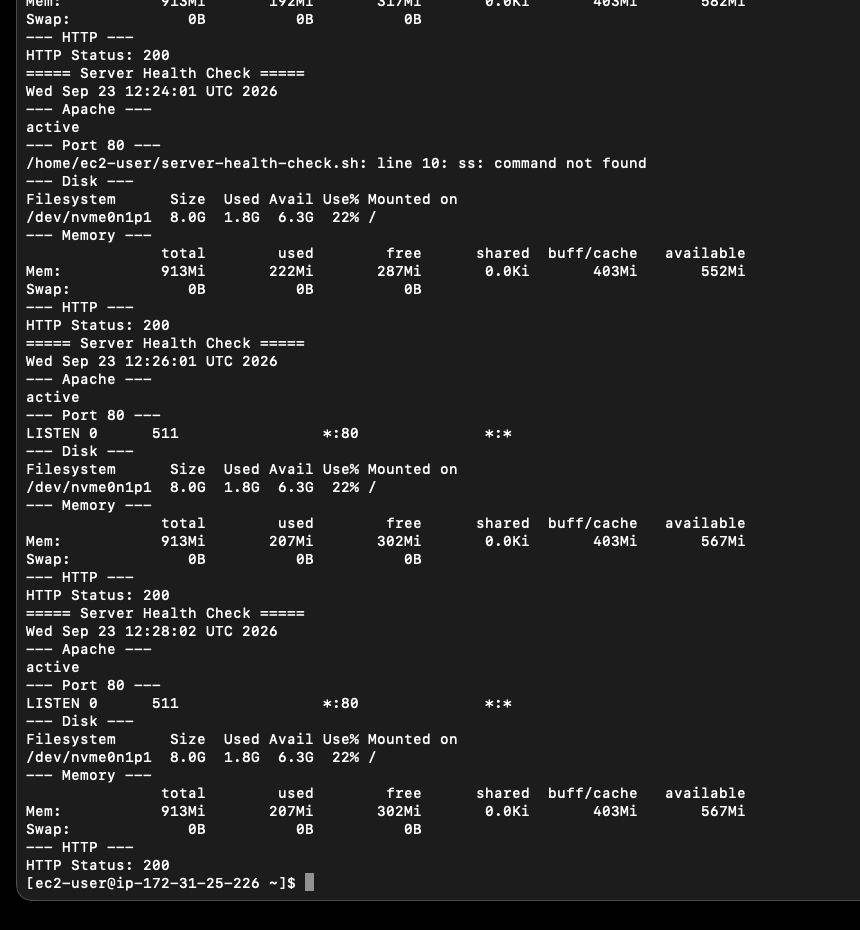

# Troubleshooting

## 1. cron実行時のPATH問題

### 事象

cronからヘルスチェックスクリプトを実行すると以下のエラーが発生。

```text
ss: command not found
```

### 原因

cron実行環境では `ss` コマンドを参照できなかった。

### 対応

`which ss` で配置場所を確認し、スクリプトを絶対パス指定へ変更。

```bash
# 修正前
ss -tln | grep :80

# 修正後
/usr/sbin/ss -tln | grep :80
```

修正後、cronから80番ポートのLISTEN状態を正常に取得できることを確認。



## 2. Apache停止によるWebアクセス障害

### 事象

障害対応の検証としてApacheを意図的に停止し、以下を確認。

```text
Apache      : inactive
Port 80     : LISTENなし
HTTP Status : 000
```

### 切り分け

```bash
sudo systemctl status httpd
ps aux | grep httpd
sudo ss -tlnp | grep :80
sudo journalctl -u httpd --since "10 minutes ago"
```

サービス停止、httpdプロセスなし、80番ポート未待受を確認。

### 対応

```bash
sudo systemctl start httpd
```

復旧後、

```text
Apache      : active
Port 80     : LISTEN
HTTP Status : 200
```

およびWebページの再表示を確認。
